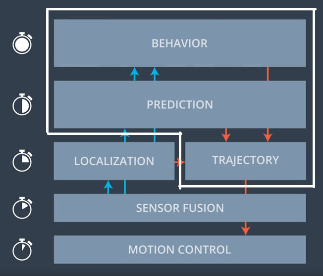

# CarND-Path-Planning-Project
Self-Driving Car Engineer Nanodegree Program

Author: David Escolme (taken from the Udacity README)

Date: 22 September 2018

### Objectives
In this project the goal is to safely navigate around a virtual highway with other traffic that is driving +-10 MPH of the 50 MPH speed limit. The car's localization and sensor fusion data is provided, there is also a sparse map list of waypoints around the highway. The car should try to go as close as possible to the 50 MPH speed limit, which means passing slower traffic when possible, note that other cars will try to change lanes too.

The car should avoid hitting other cars at all cost as well as driving inside of the marked road lanes at all times, unless going from one lane to another. The car should be able to make one complete loop around the 6946m highway. Since the car is trying to go 50 MPH, it should take a little over 5 minutes to complete 1 loop. Also the car should not experience total acceleration over 10 m/s^2 and jerk that is greater than 10 m/s^3.

#### The map of the highway is in data/highway_map.txt
Each waypoint in the list contains  [x,y,s,dx,dy] values. x and y are the waypoint's map coordinate position, the s value is the distance along the road to get to that waypoint in meters, the dx and dy values define the unit normal vector pointing outward of the highway loop.

The highway's waypoints loop around so the frenet s value, distance along the road, goes from 0 to 6945.554.

## Basic Build Instructions

1. Clone this repo.
2. Make a build directory: `mkdir build && cd build`
3. Compile: `cmake .. && make`
4. Run it: `./path_planning`.

### Simulator.
You can download the Term3 Simulator which contains the Path Planning Project from the [releases tab (https://github.com/udacity/self-driving-car-sim/releases/tag/T3_v1.2).

Here is the data provided from the Simulator to the C++ Program

#### Main car's localization Data (No Noise)

["x"] The car's x position in map coordinates

["y"] The car's y position in map coordinates

["s"] The car's s position in frenet coordinates

["d"] The car's d position in frenet coordinates

["yaw"] The car's yaw angle in the map

["speed"] The car's speed in MPH

#### Previous path data given to the Planner

["previous_path_x"] The previous list of x points previously given to the simulator

["previous_path_y"] The previous list of y points previously given to the simulator

#### Previous path's end s and d values

["end_path_s"] The previous list's last point's frenet s value

["end_path_d"] The previous list's last point's frenet d value

#### Sensor Fusion Data, a list of all other car's attributes on the same side of the road. (No Noise)

["sensor_fusion"] A 2d vector of cars and then that car's [car's unique ID, car's x position in map coordinates, car's y position in map coordinates, car's x velocity in m/s, car's y velocity in m/s, car's s position in frenet coordinates, car's d position in frenet coordinates.

## Details

1. The car uses a perfect controller and will visit every (x,y) point it recieves in the list every .02 seconds. The units for the (x,y) points are in meters and the spacing of the points determines the speed of the car. The vector going from a point to the next point in the list dictates the angle of the car. Acceleration both in the tangential and normal directions is measured along with the jerk, the rate of change of total Acceleration. The (x,y) point paths that the planner recieves should not have a total acceleration that goes over 10 m/s^2, also the jerk should not go over 50 m/s^3.

2. There will be some latency between the simulator running and the path planner returning a path, with optimized code usually its not very long maybe just 1-3 time steps. During this delay the simulator will continue using points that it was last given, because of this its a good idea to store the last points you have used so you can have a smooth transition. previous_path_x, and previous_path_y can be helpful for this transition since they show the last points given to the simulator controller with the processed points already removed. You would either return a path that extends this previous path or make sure to create a new path that has a smooth transition with this last path.

---

## Dependencies

* cmake >= 3.5
  * All OSes: [click here for installation instructions](https://cmake.org/install/)
* make >= 4.1
  * Linux: make is installed by default on most Linux distros
  * Mac: [install Xcode command line tools to get make](https://developer.apple.com/xcode/features/)
  * Windows: [Click here for installation instructions](http://gnuwin32.sourceforge.net/packages/make.htm)
* gcc/g++ >= 5.4
  * Linux: gcc / g++ is installed by default on most Linux distros
  * Mac: same deal as make - [install Xcode command line tools]((https://developer.apple.com/xcode/features/)
  * Windows: recommend using [MinGW](http://www.mingw.org/)
* [uWebSockets](https://github.com/uWebSockets/uWebSockets)
  * Run either `install-mac.sh` or `install-ubuntu.sh`.
  * If you install from source, checkout to commit `e94b6e1`, i.e.
    ```
    git clone https://github.com/uWebSockets/uWebSockets
    cd uWebSockets
    git checkout e94b6e1
    ```

## Code Description

The /src directory contains:

* main.cpp: This sets up the simulator interaction, creates and initialises a path planner class (lines 141 and 143) and calls for the next optimal path from the planner (line 260) after passing the planner the car's current position information (set_new_state at line 219) and the sensor fusion data (detect_envronment_state at line 242)
* spline.h: very helpful tool from: http://kluge.in-chemnitz.de/opensource/spline/spline.h
* helper_functions.h: taking the udacity helpers for way point calculation and coordinate transformations into a separate header file. The prime functions used were: deg2rad (line 15) and getXY (at line 19).
* bbPP.h and bbPP.cpp: the path planner class. This is described in more detail in the architecture section below but at a high level this class:
  * monitors the other cars on the road and determines if any of them are a danger to the ego vehicle, which in turn affects available options for the car to follow.
  * deduces the best option from those available using a simplified cost function decision tree which controls a target speed and target lane. The decision tree is simply:
    * If the lane ahead is clear, stay in that lane and increase speed to maximum
    * but if the lane ahead is not clear, move left or right if that is possible and either lane is clear
    * or reduce speed in the current lane if a lane move is not possible
  * generates a path for the car based on the chosen option. There are 2 methods employed:
    * JMT. This doesn't pass the rubric as the paths generate too much acceleration and jerk and are not accurate enough to stay within lanes
    * Spline. This method does pass the rubric and generates a smooth path for keeping or changing lanes
    * The option to generate the trajectory is controlled by the variable useJMT (false, true) in the Init method of the planner class (line 42)


## Path Planning Architecture

The path planner architecture can be seen below:



There are 3 parts to the path planner:

*Behaviour Planner*

This takes the car's current state (localisation) and predictions of the wider environment's state (sensor fusion) over time to create a suggested maneuveur which the trajectory module can then create and pass to the vehicle's motion controller. The planner is responsible for suggesting maneuvers which are:
  * safe
  * feasible
  * legal
  * efficient

The planner is not responsible for the execution details or collision avoidance. In this implementation, a very simple state machine is used which models 3 possible states:
  * KEEP LANE - which keeps the vehicle in the current lane at the most optimum speed possible taking account of nearby vehicles ahead of the car
  * CHANGE LEFT - which instructs the car to move to the left lane if this is feasible (e.g. the car isn't already in the left most lane and there is space in the lane to move into from the prediction data)
  * CHANGE RIGHT - which instructs the car to move to the right lane if safe to do so

A cost function is typically used to determine the best course of action. In this implementation, the cost function is a simplifed decision tree:
  * if there is no car ahead: KEEP LANE and increase speed until max speed is reached
  * else if it is safe to do so: CHANGE LEFT
  * else if it is safe to do so: CHANGE RIGHT
  * else: KEEP LANE and reduce speed until the car ahead's speed is reached

Also, multiple trajectories would normally be generated and fed into the cost function algorithm to establish the best course of action whereas in this implementation the single course of action is established and fed to the trajectory generator.

*Prediction*

The prediction module takes the car and wider environment state and predicts future car/environment state so that the behaviour planner can take the most appropriate course of action.

In this implementation, the car's end path S (longtitudinal distance) and D (latitudinal position) coordinates are compared to each of the detected car's position to determine whether any of the cars are likely to obstruct our car over the course of the next 30 metres or so. The end path is the last remaining previous path point. This is used to ensure a smooth transition from step to step.

This updates the environment state for each lane to give a target speed for each lane and whether any lane is blocked.

This in turn is passed to the behaviour planner so that the most optimal next state can be deduced.

*Trajectory*

The trajectory generator in this implementation (highway driving) takes the car's current state, the goal end state provided by the behaviour planner and plans a trajectory within the constraints of the highway (maximum speed, maximum acceleration, maximum jerk).

2 options for trajectory generation were tried:

* Jerk Minimizing Trajectory (JMT) using a quintic polynomial for both S and D based on inputs of
  * start position, velocity, acceleration
  * goal position, velocity, acceleration
  * the output is a 5th order polynomial which can be used to generate a trajectory
* Spline trajectory generation (from the project Q&A) which creates a spline function from a set of points starting with the car's current state projected 30,60, and 90 metres forward. Again, the spline is used to create X and Y points to total 50 future waypoints.

Both trajectories were then projected forward in the car's X and Y coordinates for 50 path points. On each iteration of the planner, the remaining points from the previous path were used as starting points for the new path and only points to get to the 50 total were needed from the new trajectory. In this way a smooth transition from step to step was maintained.

The spline approach generated smooth X,Y paths. The JMT approach did not. This was due to the inaccuracy in converting from frenet coordinates back to cartesian coordinates resulting in paths which were sometimes very 'jerky'.

## Code summary

Setup:

* create a planner (main.cpp line 141)
* Initialise the planner (bbPP::Init line 20) with the map (main.cpp line 143)

On each iteration:

* set the planner's new state (bbPP::set_new_state line 79) (main.cpp line 219)
* collect sensor fusion data and project forward to end of car's previous path (main.cpp line 222 to 240)
* send the sensor fusion data to the planner (bbPP::detect_environment_state line 110) (main.cpp line 241)
* add the old path, if it exists to the next path (main.cpp line 251)
* send the new path to the planner and get the best path back (bbPP::getPath line 287) (main.cpp line 260)
* send the new path to the simulator (main.cpp line 268)

In the planner class:

* Init (line 20) - initialises variables and constraints and sets up the map
* set_new_state(line 79) - sets the car s and d position to the end of the previous path (unless there is no previous path in which case the actual s and d are used), sets the car x,y, and yaw values and also v but converted to m/s. Finally the current lane is calculated (detect_current_lane line 166)
* detect_environment_state (line 110) iterates over the sensor fusion data and determines whether any car is impinging forward or lateral movement to another lane. An environment state vector, reset at each iteration, is maintained for each lane.
* getPath (line 287):
  * gets the best option (get_best_option line 242) based on the simple decision tree outlined above
  * then generates the next path using either JMT or Spline and then adds new points to the path which will already contain the remaining points of the previous path


## Reflections on the project and Improvement areas to focus on

This implementation is very simple and failed to utilise JMT trajectories owing to an inability to figure out how to generate more accurate coordinate transformations from frenet to cartesian so that the provided path was smooth.

Areas which could be enhanced:

* the car's decision making takes account of immediate highway state but is limited. This sometimes led to a 'follow' bias whereas a human driver would have slowed down and changed 2 lanes to overtake 2 lanes of slow traffic. A better environment prediction unit and a more sophisticated state machine could lead to better driving decisions.
* the planner and trajectory generator only provide a single trajectory to follow. A more sophisticated approach - as shown in the lessons - would have been to generate a set of trajectories and use a cost function to arrive at the best option.
* Using Jerk Minimizing Trajectories would guarantee jerk minimal paths. To use them, better interpolation between way points and a more accurate conversion from Frenet to Cartesian space is needed.
